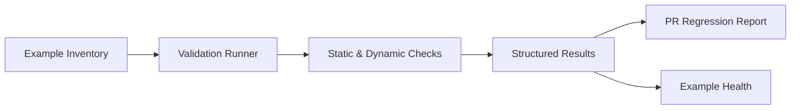
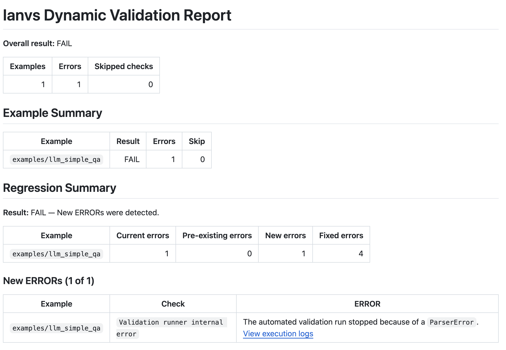

# Ianvs Example Validator

## Introduction

The Ianvs Example Validator is an inventory-driven tool for checking whether
repository examples are structurally valid, installable, and able to complete a
lightweight runtime path. Contributors can run it locally, and GitHub Actions
uses the same validator modules for pull request and broad health validation.

The validator supports static and dynamic checks, compares pull request results
with the base revision to identify regressions, and produces broad example
health evidence from T2 and T3 runs.

## Features

- **Static validation** checks paths, YAML, repository references, and common
  portability risks without executing an example.
- **Dependency validation** checks requirement declarations and can optionally
  ask pip to resolve or install them.
- **Environment preparation** executes ordered `prepare_env.steps` declared in
  the example inventory.
- **Dataset and JSONL validation** verifies the configured dataset structure,
  either independently or as part of smoke validation.
- **Runtime smoke testing** runs Ianvs with a temporary smoke benchmark.
- **Mock LLM runtime** replaces supported external LLM calls with deterministic
  responses for configured examples.
- **Regression-aware CI** compares base and pull request results so new blocking
  issues can be distinguished from pre-existing failures.
- **Example health reporting** turns broad validation results into maintained
  status evidence.

See the [validation rules](../../../docs/example_validator/validation_rules.md)
for the exact checks, contracts, and selection behavior.

## How It Works



## Validation in CI

| Tier | Purpose |
| --- | --- |
| T0 | Static validation for changed examples. |
| T1 | Dynamic validation for changed inventory entries. |
| T2 | Broad dynamic validation for validator- or core-impacting changes. |
| T3 | Broad health validation for scheduled, main-branch, or manually dispatched runs. |

Inactive entries selected by a dynamic run are reported as skipped rather than
executed. See [validation rules](../../../docs/example_validator/validation_rules.md#ci-coverage)
for the exact T0–T3 selection and workflow trigger semantics.

## Quick Start

Run commands from the Ianvs repository root. Create a disposable validator
environment and install the lightweight validator dependency:

```bash
python -m venv .venv-validator
. .venv-validator/bin/activate
python -m pip install -r .github/workflows/validator/requirements.txt
```

Run static validation for one benchmark unit:

```bash
python .github/workflows/validator/validation_runner.py \
  --static \
  --example examples/llm_simple_qa
```

After installing the Ianvs runtime prerequisites described in the
[local validation guide](../../../docs/example_validator/local_validation.md#prerequisites),
run the same dynamic stages used by CI:

```bash
python .github/workflows/validator/validation_runner.py \
  --dependency \
  --pip-install \
  --prepare-env \
  --smoke \
  --example examples/llm_simple_qa
```

For selectors, dependency modes, standalone dataset checks, reports, timeouts,
affected-example detection, and troubleshooting, see the
[local validation guide](../../../docs/example_validator/local_validation.md).

## Validation Reports

Current workflows publish a Markdown report to the GitHub Step Summary and
upload JSON and Markdown artifacts. Pull request validation also compares base
and head results and includes the regression result in the report.



See the [classification policy](../../../docs/example_validator/classification_policy.md)
for PR blocking, pre-existing failure, fixed issue, and warning semantics.

## Example Health

Broad T2 and T3 validation produces example health evidence. The
[example classification matrix](../../../examples/README.md) displays the
current published status using automatically generated snapshots.

See [example status directions](../../../docs/example_validator/status_directions.md)
for badge meanings, aggregation, publication, and validation timestamps.

## Adding a Validation Target

1. Add an entry to [`data/example_inventory.yaml`](data/example_inventory.yaml).
2. Declare the benchmark identity, paths, lifecycle status, and Python version.
3. Add dependency, preparation, dataset, and Mock Runtime metadata when needed.
4. Validate locally before changing the entry to active dynamic coverage.

The inventory schema and contracts are documented in
[validation rules](../../../docs/example_validator/validation_rules.md#inventory-rules).

## Documentation

| If you want to... | Read |
| --- | --- |
| Understand exactly what each validator checks | [Validation rules](../../../docs/example_validator/validation_rules.md) |
| Run or debug validation locally | [Local validation](../../../docs/example_validator/local_validation.md) |
| Understand why a PR is blocked or not blocked | [Classification policy](../../../docs/example_validator/classification_policy.md) |
| Understand example badges and published health | [Status directions](../../../docs/example_validator/status_directions.md) |

## Related Workflows

- [Static validation workflow](../static_code_requirement_cicd.yaml)
- [Dynamic validation workflow](../dynamic_code_cicd.yaml)
