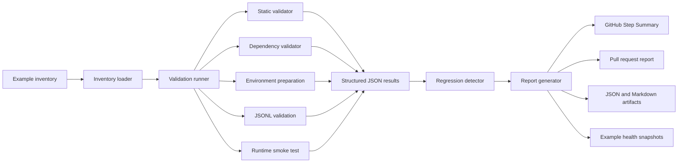
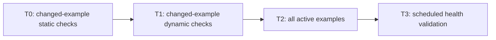
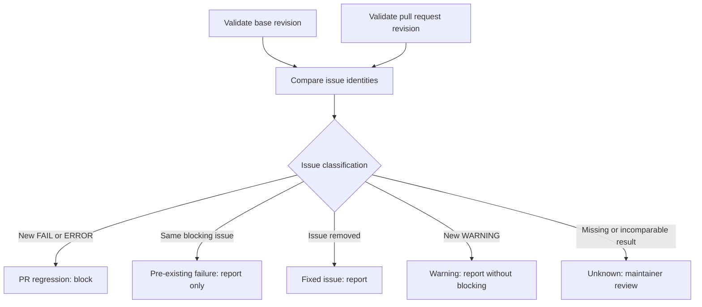

# Ianvs Example Validator

The Ianvs example validator is an inventory-driven validation system for
checking whether repository examples are structurally valid, installable, and
capable of completing a lightweight runtime path.

It is used both locally and by GitHub Actions. Pull request validation compares
the base revision with the pull request revision so that newly introduced
blocking issues fail the pull request while pre-existing maintenance debt
remains visible without blocking unrelated work.

## Background

Ianvs contains AI benchmark examples with different Python versions,
dependencies, datasets, models, APIs, and hardware assumptions. Checking that
files exist is not sufficient to establish that an example remains usable in a
clean environment. An example can also stop working over time when an external
dependency, dataset, model service, or CI runner changes.

The validator separates four related concerns:

- inexpensive static checks for configuration and portability problems;
- dynamic checks for dependencies, data preparation, and smoke execution;
- base-versus-head comparison for pull request regression detection; and
- broad scheduled validation for maintained example health.

This separation helps maintainers distinguish a pull request regression from a
pre-existing failure or time-based dependency and resource drift.

## Architecture



## Components

| Component | Responsibility |
| --- | --- |
| [`validation_runner.py`](validation_runner.py) | Selects inventory entries, runs requested validation stages, merges results, and controls the process exit code. |
| [`data/example_inventory.yaml`](data/example_inventory.yaml) | Source of truth for benchmark targets, lifecycle state, Python version, dependency files, dataset metadata, preparation steps, and mock runtime configuration. |
| [`static_validator.py`](static_validator.py) | Checks paths, YAML syntax, repository references, configuration contracts, and common portability risks without executing the example. |
| [`dependency_validator.py`](dependency_validator.py) | Checks requirement declarations, Python marker coverage, third-party imports, and optional pip resolution or installation. |
| [`smoke_test_validator.py`](smoke_test_validator.py) | Runs ordered environment preparation, validates JSONL data, prepares temporary smoke configuration, and executes the runtime smoke path. |
| [`services/inventory_loader.py`](services/inventory_loader.py) | Loads and normalizes inventory entries, detects affected examples, and builds CI matrices. |
| [`services/regression_detector.py`](services/regression_detector.py) | Compares base and pull request results and identifies new, pre-existing, and fixed issues. |
| [`services/report_generator.py`](services/report_generator.py) | Combines result artifacts and produces Markdown reports, workflow annotations, pull request comments, and health snapshots. |
| [`services/mock_runtime/`](services/mock_runtime/) | Replaces supported external LLM calls with deterministic responses during configured smoke validation. |

## Validation stages

### Static validation

Static validation does not execute an example. It checks:

- example, benchmark, requirements, and preparation paths;
- YAML syntax and repository-local references;
- environment preparation and mock runtime contracts;
- contributor-specific absolute paths and local model paths;
- CUDA-only assumptions without an availability check or CPU fallback; and
- metric implementations that may divide by an empty collection.

Some static findings are heuristic. Conditions that directly prevent the
configured validation path from running are blocking; portability and
maintenance risks are reported as warnings.

### Dependency validation

Dependency validation checks requirement file presence and syntax, supported
Python marker coverage, and obvious undeclared third-party imports. Pip
resolution and installation are opt-in operations because they may require
network access and can be expensive for machine-learning examples.

### Environment, dataset, and smoke validation

Dynamic validation can:

1. install the example dependencies;
2. execute ordered environment preparation steps declared by the inventory;
3. validate the configured JSONL dataset structure; and
4. execute Ianvs with a temporary smoke benchmark configuration.

When an inventory entry enables the mock runtime, the smoke test substitutes
deterministic LLM responses. A passing `mocked_llm` result confirms the tested
integration path only. It does not establish that a real model, external
provider, GPU, or output quality has passed.

## Validation tiers

| Tier | Selection | Checks |
| --- | --- | --- |
| T0 | Inventory examples changed by a pull request | Static validation |
| T1 | Active examples changed by a pull request | Dependencies, environment preparation, dataset, and smoke validation |
| T2 | Changes to shared `core/`, workflow, or validator code | Dynamic validation for all active inventory targets |
| T3 | Scheduled or broad main-branch run | Dynamic validation for all active targets and health snapshot publication |



## Pull request decisions

CI runs the selected validators against both the pull request base and head
revisions. The regression detector compares issues by example, check, file, and
diagnostic detail. Git diff line mappings prevent an unchanged issue from being
classified as new only because nearby lines moved.



| Base result | Pull request result | Classification | Blocks the pull request |
| --- | --- | --- | --- |
| No blocking issue | New `FAIL` or `ERROR` | PR regression | Yes |
| Same blocking issue | Issue remains | Pre-existing failure | No |
| Blocking issue | Issue is removed | Fixed | No |
| Passing | New `WARNING` only | Passed with warning | No |
| Result cannot be compared reliably | Indeterminate | Unknown | Maintainer review |

## Reports and published health

The generated report begins with the overall result and the number of examples,
blocking errors, and skipped checks. Its regression summary then separates
current issues into pre-existing, newly introduced, and fixed issues. This is
the section reviewers should use when deciding whether a failure belongs to the
pull request.


In this example, the pull request result contains one current error. The error
is new relative to the base result, so the regression result is `FAIL` and the
pull request is blocked. Four base-revision errors are no longer present and are
reported separately as fixed. The detailed row identifies the affected example,
the failed check, and the normalized error type (`ParserError`). **View execution
logs** links to the workflow run for the traceback and command output needed to
diagnose the failure.

CI reports describe a particular validation run. Maintained T2 and T3 results
are also published as example health snapshots. The current user-facing status
and classification matrix is available in the
[`examples/README.md`](../../../examples/README.md). Use the newest complete
T2/T3 evidence when a matrix status and an older workflow report disagree.

## Local usage

Run all commands from the Ianvs repository root.

### Prerequisites

- Python 3.8 or the `python_version` declared by the selected inventory entry;
- Git; and
- a disposable virtual environment for dependency installation and dynamic
  validation.

Install the lightweight validator dependency:

```bash
python -m venv .venv-validator
. .venv-validator/bin/activate
python -m pip install -r .github/workflows/validator/requirements.txt
```

Dynamic smoke execution also requires Ianvs:

```bash
python -m pip install -r requirements.txt
python -m pip install resources/third_party/sedna-0.6.0.1-py3-none-any.whl
python -m pip install -e . --no-deps
```

### Run static validation

Validate all active inventory entries:

```bash
python .github/workflows/validator/validation_runner.py --static --all
```

Validate one benchmark unit. `--example` accepts an inventory name, example
path, or benchmark file and can be repeated:

```bash
python .github/workflows/validator/validation_runner.py \
  --static \
  --example examples/llm_simple_qa
```

When no dynamic stage is selected, the runner performs static validation by
default.

### Run dynamic validation

The following command installs example dependencies into the active
environment, prepares the dataset, validates JSONL, and executes the smoke path:

```bash
python .github/workflows/validator/validation_runner.py \
  --prepare-env \
  --smoke \
  --example examples/llm_simple_qa \
  --timeout 600
```

Use a disposable virtual environment with `--pip-install`; installing an
example's dependencies can change existing packages.

### Validate dependencies

Check declarations without asking pip to resolve or install packages:

```bash
python .github/workflows/validator/validation_runner.py \
  --dependency \
  --example examples/llm_simple_qa
```

Ask pip to resolve dependencies without installing them:

```bash
python .github/workflows/validator/validation_runner.py \
  --dependency \
  --pip-install-check \
  --example examples/llm_simple_qa
```

### Save a report

Markdown is printed to standard output by default. Use `--format` and
`--report` to save Markdown or JSON:

```bash
python .github/workflows/validator/validation_runner.py \
  --static \
  --example examples/llm_simple_qa \
  --format json \
  --report /tmp/llm-simple-qa-validation.json
```

The runner exits with code `0` when no check contains `FAIL` or `ERROR`, and
with code `1` otherwise. `WARNING` and `SKIP` remain visible but do not change
the exit code.

### Detect affected examples

Reproduce CI target selection between two Git revisions:

```bash
python .github/workflows/validator/services/inventory_loader.py \
  --mode static \
  --base-ref upstream/main \
  --head-ref HEAD

python .github/workflows/validator/services/inventory_loader.py \
  --mode dynamic \
  --base-ref upstream/main \
  --head-ref HEAD
```

Static selection considers changed Python and YAML files below inventory
example paths. Dynamic selection includes changed examples and expands to all
inventory examples when shared `core/` or `.github/workflows/` files change.
Only active entries execute dynamic stages; explicitly selected inactive
entries are reported as skipped.

## Adding a validation target

1. Add one inventory entry for each benchmark job or benchmarking YAML.
2. Declare its `name`, `example`, `path`, `benchmark_file`, lifecycle `status`,
   and supported `python_version`.
3. Add `requirements_file`, dataset metadata, ordered `prepare_env.steps`, and
   mock runtime configuration when applicable.
4. Run T0 static validation for the new selector.
5. Run dependency, preparation, JSONL, and smoke validation in a disposable
   environment before activating dynamic CI coverage.
6. Inspect both the human-readable report and structured JSON result.

An inventory entry is the validation unit. Do not combine multiple benchmark
jobs into one result merely because they share an example directory.

## Result levels

| Result | Meaning | Fails an individual validator run |
| --- | --- | --- |
| `PASS` | The check completed without finding an issue. | No |
| `FAIL` | Execution or a validation requirement failed. | Yes |
| `ERROR` | A required file, configuration, or structural rule failed. | Yes |
| `WARNING` | A portability or maintenance risk was found. | No |
| `SKIP` | The check was not applicable or could not run. | No |

An individual report treats `FAIL` and `ERROR` as blocking. The regression
policy separately decides whether the issue was introduced by the pull request.

## Future directions

### Extensibility

- Define a common validator interface and a registry for optional checks.
- Publish a versioned JSON Schema for inventory and result artifacts.
- Separate internal validator failures, timeouts, and configuration errors into
  more precise machine-readable categories.

### Validation coverage

- Add Markdown and README contract checks.
- Replace suitable regular-expression heuristics with AST analysis or schemas.
- Describe GPU, memory, accelerator, and external-service requirements in the
  inventory.
- Add semantic benchmark-result and model-output checks.
- Support additional dataset formats beyond JSONL.

### Reliability and security

- Isolate dependency installation and example execution in containers.
- Restrict preparation script filesystem and network access.
- Add retry, flaky-result detection, and quarantine workflows.
- Cache package and dataset inputs without reusing old validation conclusions.

### Reporting and observability

- Publish validation history and failure trends.
- Compare results across Python versions and runner environments.
- Publish independent health snapshots for every benchmark job.
- Record duration and resource consumption for each validation stage.
- Track validator test coverage and performance regressions.

## Documentation

- [Validation rules](../../../docs/example_validator/validation_rules.md)
- [Local validation](../../../docs/example_validator/local_validation.md)
- [Classification policy](../../../docs/example_validator/classification_policy.md)
- [Example status directions](../../../docs/example_validator/status_directions.md)
- [Static validation workflow](../static_code_requirement_cicd.yaml)
- [Dynamic validation workflow](../dynamic_code_cicd.yaml)
