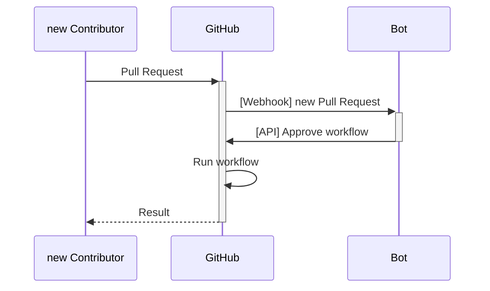
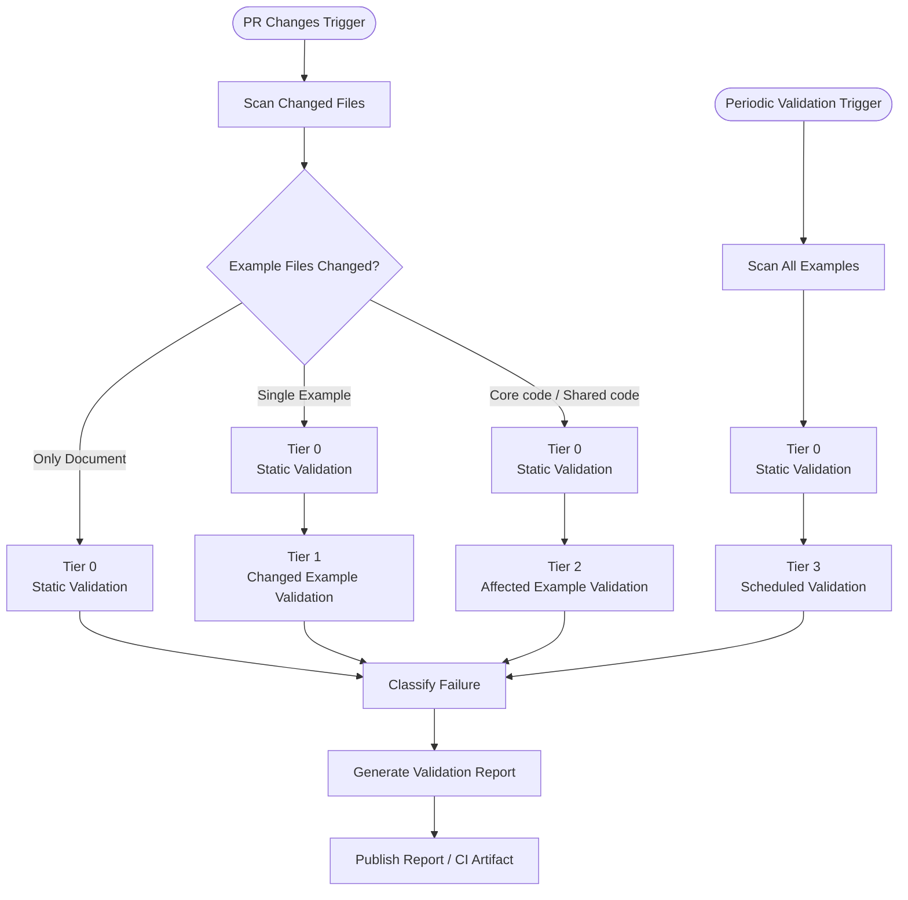
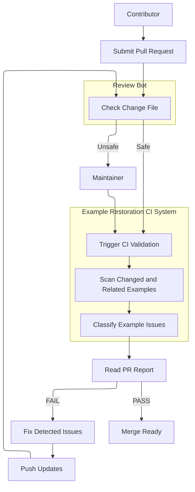
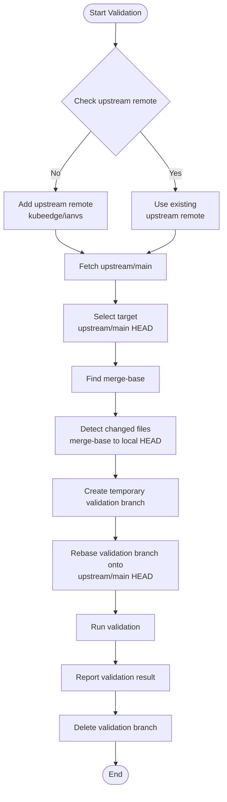
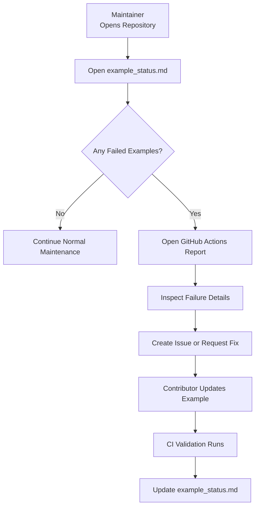

# KubeEdge Ianvs Example Classification CI Validation Framework

Automated Example Classification, Validation, and `llm_simple_qa` Restoration for Sustainable Ianvs Example Maintenance

---

## Background

Ianvs is the KubeEdge SIG AI distributed benchmark toolkit. It provides benchmark examples for edge AI, cloud-edge collaborative inference, federated learning, lifelong learning, LLM benchmarking, robotics, and other distributed AI scenarios.

As the number of Ianvs examples continues to grow, the project faces increasing usability and maintenance challenges. Historical examples may fail due to Python version changes, evolving dependencies, third-party library updates, outdated runtime configurations, missing datasets, hardcoded local paths, and documentation that no longer matches the actual implementation.

These problems create difficulties for both maintainers and users. Maintainers cannot easily determine which examples are currently healthy, which are broken, or which require external resources or special hardware. New developers and enterprise users may also fail to run examples from a clean environment because there is no clear classification of example status.

This proposal introduces a CI-based example classification and validation framework for Ianvs. The goal is to make example status visible, repeatable, and maintainable. The CI pipeline will act as a validation and reporting layer around Ianvs examples, helping maintainers classify example health and helping contributors understand whether their changes introduce regressions.

This proposal keeps the main focus on example classification and CI validation, but it also includes concrete restoration work for `examples/llm_simple_qa`. The example is selected as the initial repair target because it exposes a representative set of problems that the framework should detect, report, and verify after repair: hardcoded local paths, unclear dataset setup, invalid JSONL risks, local-only model paths, CUDA-only assumptions, incomplete dependency documentation, and metric edge cases.

The project does not aim to restore every broken example in Ianvs. Broad example repair should still be handled by separate proposals or follow-up tasks. The exception in this proposal is `examples/llm_simple_qa`: this project will repair it to become a portable, clean-environment reference example, and the CI framework will verify that restoration.

---

## Goals

The goals of this project are:

* Build an example inventory and classification matrix.
* Introduce automated CI validation for example status classification.
* Detect hardcoded paths, missing files, dependency issues, dataset issues, model-loading assumptions, hardware assumptions, and runtime failures.
* Support multi-version Python validation where practical.
* Provide local validation tools for contributors.
* Prevent pull requests from breaking already validated examples.
* Distinguish PR-introduced regressions from pre-existing or time-based failures.
* Reduce unnecessary CI runtime through tiered validation.
* Generate readable example health reports for maintainers.
* Use `examples/llm_simple_qa` as the initial validation target, repair target, and reference example for LLM-related example checks.
* Repair `examples/llm_simple_qa` so it becomes portable and reproducible from a clean Ianvs clone, then define CI-verifiable checks to prevent regression.

For maintainers, the project aims to reduce manual review burden and provide better visibility into example health.

For contributors, the project aims to provide clear local and CI feedback about whether their changes affect validated examples.

For developers and enterprise users, the project aims to make the status of Ianvs examples easier to understand before they attempt to run or reuse them.

---

## Problem Statement

Ianvs currently faces four major classes of example maintenance problems.

### 1. Unclear Example Health Status

Some examples may be runnable, while others may be partially runnable, broken, dependent on large datasets, or dependent on GPU or special hardware.

Without a systematic classification mechanism, maintainers and users cannot easily know:

* Which examples are currently validated
* Which examples are known to fail
* Which examples require external datasets
* Which examples require GPU or special hardware
* Which examples are affected by dependency drift
* Which examples should be excluded from normal PR-blocking checks
* Which examples have clean-environment validation evidence

### 2. Example Execution Failures

Some examples fail to execute due to stale paths, missing configuration files, outdated dependencies, or runtime incompatibilities.

Common failure patterns include:

* Broken YAML paths
* Hardcoded local paths
* Missing datasets
* Missing model resources
* Invalid or undocumented dataset formats
* Python version incompatibility
* Framework API changes
* Device assumptions such as CUDA-only execution
* Metric evaluation edge cases

`examples/llm_simple_qa` is a useful initial target because it contains many of these failure patterns in a compact example. The current known blockers include outdated README/YAML paths, references to local paths such as `/home/icyfeather/...`, unclear dataset preparation, invalid multi-line JSONL risks, local Qwen model paths, CUDA-only assumptions, incomplete dependency documentation, and possible metric failure when no valid prediction-answer pairs exist.

This project will detect and classify these failures. It will also repair `examples/llm_simple_qa` so that it becomes a portable reference example. Broad restoration of all examples remains outside the scope of this proposal.

### 3. Lack of Automated Validation

Currently, example failures are often discovered manually by users or contributors. Pull requests may unintentionally break previously validated examples because there is no systematic CI validation for example status.

For LLM examples, this problem is amplified by model loading, tokenizer availability, device selection, external datasets, and heavyweight dependencies. CI should therefore distinguish between lightweight static checks, dependency checks, dataset-format checks, and optional runtime smoke tests.

### 4. Increasing Maintainer Burden

As the number of examples increases, manually checking and classifying each example becomes unrealistic. Maintainers need automated feedback to understand which examples are healthy, which examples are broken, and which PRs introduce regressions.

In addition, GitHub Actions workflows that can affect CI execution often require maintainer approval before they can run on pull requests from new contributors. Requiring a maintainer to repeatedly inspect and approve obviously safe pull request updates creates operational overhead and delays validation feedback.

---

## Proposal

This project proposes a non-intrusive CI validation framework for Ianvs examples.

The CI pipeline will not replace Ianvs' core execution logic. Instead, it will validate and classify Ianvs examples by checking configuration files, dependencies, datasets, documentation consistency, hardware assumptions, model-loading assumptions, and selected smoke-test executions.

The proposal contains three major parts:

1. Example inventory and classification
2. CI validation framework
3. Reporting and contributor feedback system

The CI framework shall detect examples affected by a pull request and execute the corresponding validation workflow only for those examples.

Lightweight static checks will run across relevant examples on every pull request. More expensive dependency checks, dataset checks, and smoke tests will run only for changed examples or examples affected by shared code changes.

A broader validation suite will run on a scheduled basis to detect time-based failures such as dependency drift, dataset unavailability, model download failure, or CI environment changes.

A possible future extension is an automatic review bot for pull requests. If maintainers later decide the extra automation is worthwhile, the bot can inspect the diff against the `main` branch and auto-approve workflow execution only when CI-sensitive code such as `.github/` workflows or `resources/tools/` automation is unchanged. Pull requests that touch CI-sensitive paths would still remain pending for maintainer review and approval.

This proposal focuses on classification, validation, reporting, and one concrete restoration target: `examples/llm_simple_qa`. Fixing every broken example, replacing datasets for all examples, or rewriting all outdated documentation is out of scope and should be handled by separate restoration proposals or follow-up issues.

For `examples/llm_simple_qa`, this proposal adds a focused target: the validation framework should be able to confirm whether the example can run from a clean clone with portable paths, reproducible dataset setup, valid JSONL, configurable model loading, CUDA/MPS/CPU fallback, documented dependencies, and robust metric behavior.

---

## Scope

### In Scope

The project will include:

* Example inventory and classification
* Static validation scripts
* Dependency validation
* Dataset and JSONL validation support for selected examples
* Model path and hardware assumption checks for LLM examples
* Example smoke testing for selected examples
* GitHub Actions workflow
* Local validation commands
* Example health reporting
* Failure classification
* Tiered validation strategy for PR and scheduled workflows
* Documentation for validation rules and local validation usage
* Initial validation coverage for `examples/llm_simple_qa`
* Restoration of `examples/llm_simple_qa` portability and clean-environment execution

### Out of Scope

The project will not:

* Restore or repair every broken example in the repository beyond `examples/llm_simple_qa`
* Rewrite all outdated example implementations
* Replace missing datasets or model resources for all examples
* Redesign the benchmark execution framework
* Replace Ianvs core architecture
* Replace KubeEdge or edge-cloud synergy components
* Rewrite all examples at once
* Run every example fully on every pull request
* Introduce core code changes unless repeated CI failures reveal a framework-level issue
* Guarantee that every classified example becomes runnable during this project
* Treat missing `preprocess()` as an active blocker for `llm_simple_qa`, because PR #407 already addressed the relevant core-side `_preprocess()` behavior

The design principle is:

```text
Classify broadly, repair `llm_simple_qa` in this proposal, and repair other examples in separate proposals.
```

A secondary principle is:

```text
CI first, core changes only when necessary.
```

For `examples/llm_simple_qa`, the framework should classify failures and verify restoration targets. If restoration changes are implemented in a related PR, this proposal should reuse or merge them. Otherwise, this project will implement the missing `llm_simple_qa` restoration changes directly and validate them through CI.

---

## Target Users

### User Group A: Ianvs Maintainers

Maintainers need automated validation to understand example health and prevent validated examples from being broken by new changes.

Main needs:

* Classify example status
* Detect example regressions early
* Understand which examples are runnable, broken, skipped, resource-dependent, model-dependent, or hardware-dependent
* Review PRs with CI evidence
* Track example health over time
* Reduce manual debugging and classification effort
* Avoid blocking unrelated PRs because of pre-existing or time-based failures

### User Group B: Contributors

Contributors need a clear way to validate their changes before opening a pull request.

Main needs:

* Run local validation commands
* Understand why validation fails
* Reproduce CI failures locally
* Know whether a failure was introduced by their PR or already existed
* Avoid being responsible for unrelated historical failures
* Understand which examples are validated and which are classified as known failures

### User Group C: Developers and Enterprise Users

Developers and enterprise users need to know whether examples are likely to run before adopting them.

Main needs:

* Identify validated examples
* Understand the dataset, dependency, model, and hardware requirements
* Avoid spending time on examples already classified as broken or resource-dependent
* Use example status reports to select suitable examples
* Trust that validated examples are monitored by CI

---

## Design Details

### Relationship Between CI and Ianvs

The CI pipeline is a validation and classification layer around Ianvs examples.

```text
Ianvs = benchmark execution framework
CI = automated validation and classification mechanism for Ianvs examples
```

CI will call Ianvs commands, inspect example configuration files, verify dependencies, validate datasets where practical, check documentation consistency, and report whether examples remain runnable or require special classification.

The CI pipeline mainly interacts with:

* `examples/`
* `benchmarkingjob.yaml`
* `testenv.yaml`
* `testalgorithms/`
* example README files
* dependency files
* dataset path configuration
* model configuration
* runtime execution commands
* evaluation metric files
* related documents

The first version should avoid core Ianvs changes. Core changes should only be considered when multiple examples fail due to the same framework-level behavior, and such changes should be discussed separately.

### Use Cases

The proposal covers seven primary validation use cases.

#### UC-01: Pull Request Regression Handling

A contributor submits a pull request and needs the validation system to distinguish a regression introduced by the pull request from a failure that already exists in the base branch.

In this use case, pull request validation is triggered automatically after the contributor submits the pull request. The workflow compares the base result and the pull request result, then generates a regression report for the contributor to read. If the comparison shows that the pull request introduced a new regression, the workflow should block the pull request until the contributor fixes it. If the failure already exists in the base branch, the workflow should report the pre-existing failure without blocking the pull request for that specific issue.

The goal is to make pull request feedback fair and actionable by blocking only PR-introduced regressions while still surfacing pre-existing failures to maintainers and contributors.


#### UC-02: Document-Only Pull Request Validation

A contributor submits a pull request that changes documentation only, such as example README files, usage guides, or related proposal documents.

In this use case, the CI workflow runs static documentation validation instead of example execution-oriented validation. The workflow generates a documentation validation report, and maintainers review the result to decide whether the pull request can be merged or whether documentation fixes are still needed. If validation fails, the failure should be classified as a documentation issue rather than as an example runtime regression.

The goal is to avoid unnecessary runtime validation for document-only changes while still preserving documentation quality and consistency.


#### UC-03: Single Example Change Pull Request Validation

A contributor submits a pull request that changes one example without modifying the shared Ianvs core or CI-sensitive framework code.

In this use case, the workflow detects the changed example, runs affected-example validation, applies the appropriate validation tier, and generates a pull request health report. If validation fails, the workflow should classify the failure so maintainers can distinguish a newly introduced regression from a pre-existing or unrelated problem. Maintainers then review the validation result and decide whether to merge the pull request or request fixes.

The goal is to keep pull request validation targeted, efficient, and actionable for ordinary example-level contributions.


#### UC-04: Core Code Change Pull Request Validation

A contributor submits a pull request that changes shared Ianvs core code, common execution logic, or other paths that may affect multiple examples at once.

In this use case, the CI workflow runs a broader regression validation scope than example-only changes. It generates a pull request health report for maintainer review, and any validation failure should be classified so the project can distinguish a true cross-example regression from an unrelated environmental issue. Maintainers use the result to decide whether the pull request is safe to merge or requires additional fixes.

The goal is to protect validated examples from framework-level regressions when shared code changes have a wider blast radius.


#### UC-05: Local Validation Before Pull Request Submission

A contributor wants to validate changes locally before opening or updating a pull request.

In this use case, the contributor runs the local validation workflow with `nektos/act` or an equivalent local entry point. The workflow syncs with the upstream baseline, prepares a temporary validation branch, runs validation locally, and generates a local report. The validation flow should always include static validation and may extend to smoke testing when the changed example or validation tier requires runtime execution. If the local run fails, the contributor should fix the failure before opening or updating the pull request.

The goal is to give contributors fast feedback before CI review, reduce avoidable pull request failures, and make CI results easier to reproduce locally.


#### UC-06: Scheduled Validation and Time-Based Failure Triage

A maintainer wants the project to periodically re-validate examples even when no pull request is open, so the team can detect dependency drift, dataset availability problems, model download failures, and other time-based breakages.

In this use case, a scheduled CI workflow runs the broader validation suite, detects time-based failures, classifies likely drift causes, and generates a health report for maintainer review. When a scheduled run identifies a failure, maintainers triage the result and choose an appropriate follow-up action, such as marking the example as a known failure, creating a follow-up issue, or quarantining a broken example until it is repaired. This workflow should distinguish scheduled drift detection from pull request regression detection so contributors are not blamed for failures introduced by the external environment over time.

The goal is to give maintainers continuous visibility into example health, surface long-term ecosystem drift early, and provide a structured response path for scheduled validation failures.


#### UC-07: Example Status Management and Classification Review

A maintainer wants to review the current status of examples and update their classification based on validation evidence, environment requirements, and reported failures.

In this use case, the maintainer reviews the example report, views the current example status, and decides whether a failure should block a pull request. Based on the validation result, the maintainer may update the example classification to reflect operational constraints such as GPU requirements, external dataset requirements, or model download requirements. When the reported status reveals a follow-up maintenance task, the maintainer may also create a follow-up issue to track restoration or cleanup work.

The goal is to make example health classification explicit, keep maintainer decisions consistent, and ensure the project records whether a failure is blocking, expected, or caused by special runtime prerequisites.


### Automatic Workflow Approval Bot

As a future extension, the project can add a lightweight GitHub-integrated review bot that reduces the need for maintainers to manually approve workflow execution on pull requests from new contributors.

The bot should:

* Trigger when a pull request is opened, synchronized, or reopened.
* Compare the pull request diff against the current `main` branch.
* Detect whether the pull request changes CI-sensitive paths, especially `.github/` and `resources/tools/`.
* Automatically approve workflow execution when CI-sensitive paths are not changed.
* Leave the pull request for maintainer review when CI-sensitive paths are changed.
* Re-run the same decision on every pull request update so approval reflects the latest diff.

This bot is not intended to replace code review. Its purpose is only to automate workflow approval gating for low-risk pull requests so contributors can receive CI feedback faster while maintainers retain control over workflow and tooling changes.

The interaction is:



In this design, workflow approval is based on path-level risk classification:

* Safe for automatic approval: pull requests that do not modify `.github/` or `resources/tools/`
* Requires maintainer review: pull requests that modify `.github/`, `resources/tools/`, or other paths later designated as CI-sensitive

This keeps the approval rule simple, auditable, and aligned with the goal of protecting CI execution logic while removing repetitive maintainer work for ordinary example or documentation changes.

---

## Architecture and Modules

The proposed framework adds a validation layer around existing Ianvs examples.

```text
Ianvs Repository
├── examples/
│   ├── llm_simple_qa/
│   │   └── scripts/
│   │       └── prepare_dataset.py
│   ├── example A/
│   ├── example B/
│   └── ...
│
├── resources/
│   └── tools/
│       └── example_validation/
|           ├── data/
|           |   └── example_inventory.yaml
│           ├── validate_examples.py
│           ├── inventory.py
│           ├── static_validator.py
│           ├── dependency_validator.py
│           ├── dataset_validator.py
│           ├── smoke_test_runner.py
│           └── report_generator.py
│
├── docs/
│   └── example_validation/
│       ├── validation_rules.md
│       ├── classification_policy.md
│       ├── example_status.md
│       └── local_validation.md
│
└── .github/
    └── workflows/
        └── example_validation.yml
```

The responsibilities of the proposed files are:

| Path | Responsibility |
|---|---|
| `examples/` | Stores Ianvs example projects, including their runnable configurations, documentation, dependency references, dataset references, and algorithm-related files. These directories are the validation targets of the framework. |
| `examples/<example_name>/scripts/prepare_dataset.py` | Provides the standard dataset preparation entry point for examples that support automated dataset setup. It should download, generate, or normalize the required dataset into the documented directory structure from a clean environment. |
| `resources/tools/example_validation/data/example_inventory.yaml` | Stores the example inventory and classification metadata, including each example's path, validation level, dataset requirements, dependency requirements, model requirements, hardware requirements, current status, expected dataset structure, and whether the dataset is external when automated preparation is unavailable. |
| `resources/tools/example_validation/validate_examples.py` | Serves as the main entry point for local and CI validation. It should parse CLI arguments, load the inventory, select validation stages, invoke the validator modules, and coordinate report generation. |
| `resources/tools/example_validation/inventory.py` | Loads and manages the example inventory. It should provide structured metadata access, helper logic for selecting changed or affected examples, and shared inventory operations used by the validation pipeline. |
| `resources/tools/example_validation/static_validator.py` | Performs lightweight static checks without executing examples. It should detect problems such as missing files, invalid YAML, broken relative paths, hardcoded local paths, outdated repository layout references, README and configuration mismatches, local-only model paths, and CUDA-only assumptions. |
| `resources/tools/example_validation/dependency_validator.py` | Validates whether example dependencies are properly declared and installable. It should check dependency file presence, package installation behavior, Python version compatibility, and dependency-related failures that block clean-environment execution. |
| `resources/tools/example_validation/dataset_validator.py` | Validates dataset-related requirements and lightweight data structure correctness. It should check dataset path consistency, `prepare_dataset.py` availability when automation is supported, declared dataset structure in the inventory, `external` classification when automation is unavailable, and format validity for files such as JSONL. |
| `resources/tools/example_validation/smoke_test_runner.py` | Runs lightweight execution tests for selected examples to confirm that they can start and complete a minimal validation run in CI without requiring full benchmark workloads where possible. |
| `resources/tools/example_validation/report_generator.py` | Converts validation results into human-readable CI summaries and example health reports, including failure classifications, reproduction commands, and suggested next actions for contributors and maintainers. |
| `docs/example_validation/validation_rules.md` | Documents the validation rules implemented by the framework, including what each validator checks, why the rule exists, and how maintainers should interpret its result. |
| `docs/example_validation/classification_policy.md` | Defines the example status model and failure classification policy, including which failure types block pull requests and which should be treated as known, pre-existing, or time-based failures. |
| `docs/example_validation/example_status.md` | Serves as the maintainer-facing summary of current example health. It should present the latest classified status for examples, link or point to the underlying CI evidence when needed, and provide a stable place to track whether an example is validated, degraded, quarantined, external-resource-dependent, or awaiting follow-up repair work. |
| `docs/example_validation/local_validation.md` | Documents how contributors run validation locally, including example commands, expected usage patterns, local troubleshooting, and optional workflow-level local verification guidance. |
| `.github/workflows/example_validation.yml` | Defines the GitHub Actions workflow that runs the validation tiers, collects results, and publishes CI summaries or report artifacts. |

---

## Module Details

### 1. Example Inventory Module

Purpose:

* Track all Ianvs examples and their validation status.

Responsibilities:

* List examples
* Record benchmark configuration path
* Record dataset requirements
* Record dependency requirements
* Record hardware requirements
* Record model requirements
* Record validation level
* Classify example status
* Record whether failures are known, newly introduced, or time-based
* Record clean-environment validation evidence when available

Output:

* Example Classification Matrix

Example status categories:

* Runnable
* Partially runnable
* Broken
* Not validated yet
* Requires external dataset
* Requires model download
* Requires GPU or special hardware
* Quarantined
* Known failure
* Dependency drift
* Dataset or resource unavailable
* CI environment issue

Example inventory metadata may include:

```yaml
examples:
  - name: llm_simple_qa
    path: examples/llm_simple_qa
    benchmark_config: benchmarkingjob.yaml
    requirement_file: examples/llm_simple_qa/requestment.txt
    dataset:
      required: true
      external: false
      prepare_script: examples/llm_simple_qa/scripts/prepare_dataset.py
      root: dataset/llm_simple_qa
      structure:
        - train_data/data.jsonl
        - test_data/data.jsonl
      format: jsonl
    model_required: true
    gpu_required: false
    validation_level: smoke
    status: runnable
    blocking: true
    clean_environment_validated: false
```

---

### 2. Static Validation Module

Purpose:

* Detect common configuration and path problems before runtime execution.

Checks:

* Hardcoded absolute paths
* Missing YAML files
* Missing README files
* README contains setup steps, execution commands, and troubleshooting information when such checks can be performed statically
* Broken dataset paths
* Broken algorithm paths
* Broken test environment paths
* Invalid YAML syntax
* Outdated repository layout references
* README commands that do not match existing files
* Local model paths
* CUDA-only hardcoding where CPU fallback should be supported
* Missing model override documentation
* Missing CPU fallback
* Missing tokenizer/model dependency documentation
* Metric edge cases caused by empty predictions or empty answer pairs when the risk can be detected statically
* Dataset format mismatch between README, YAML, and runtime code
* README contains dependency installation instructions
* README contains dataset preparation instructions
* README references the standard `prepare_dataset.py` flow when the example supports automated dataset setup
* README contains JSONL format when applicable
* README contains model configuration instructions when applicable
* README paths match YAML paths
* Dependency documentation matches actual requirements

Example checks:

```text
/home/username/...
/home/icyfeather/...
/home/.*/models
examples/old_path/...
examples/llm/singletask_learning_bench/simple_qa
missing benchmarkingjob.yaml
missing testenv.yaml
device = "cuda"
```

Output:

* Static validation report
* Classification update for affected examples

Example static validation report:

```md
# Static Validation Report

## Example

examples/llm_simple_qa

### Validation Result

| Check | Result |
|---|---|
| benchmarkingjob.yaml exists | PASS |
| testenv.yaml exists | PASS |
| README exists | PASS |
| Hardcoded path check | FAIL |
| Dataset path validation | FAIL |
| Local model path check | FAIL |
| CUDA-only device check | FAIL |

### Failure Details

#### Hardcoded Path

File:

examples/llm_simple_qa/benchmarkingjob.yaml

Detected:

`/home/user/...`
```

Static validation should be lightweight enough to run across relevant examples on every pull request.

For `examples/llm_simple_qa`, static validation should also confirm:

* The README explains the example overview, setup steps, dependency installation, dataset preparation, JSONL format, model configuration, run command, expected output, and troubleshooting.
* Dataset preparation uses `prepare_dataset.py` when the example supports automated setup, and the documented dataset layout matches the structure declared in `example_inventory.yaml`.
* Model loading uses a portable model ID or a documented override mechanism instead of local-only paths.
* Device selection supports CUDA, MPS, and CPU fallback rather than assuming CUDA-only execution.
* Metric handling avoids crashes when no valid prediction-answer pairs exist, for example by returning `0.0` and logging a warning instead of triggering `ZeroDivisionError`.
* Related PRs from Issue/PR #452 that already solve part of the restoration work are reflected consistently in the updated documentation and example configuration.

---

### 3. Dependency Validation Module

Purpose:

* Verify whether dependencies are installable and compatible.

Checks:

* Dependency file availability
* Package installation
* Python version compatibility
* Dependency conflicts
* Missing runtime packages
* Example-specific dependency documentation

Initial Python matrix:

* Python 3.8
* Python 3.9
* Python 3.10

For `examples/llm_simple_qa`, the validation framework should recognize the planned dependency file:

```text
examples/llm_simple_qa/requestment.txt
```

Planned content:

```text
# Machine Learning Libraries
transformers >= 4.45.0
torch >= 2.0.0
accelerate >= 1.0.0
```

If maintainers prefer the standard spelling `requirements.txt`, the file name can be adjusted during review. The CI framework should validate whichever path is recorded in the example inventory.

Output:

* Dependency compatibility report
* Dependency-related classification result

Dependency validation should run mainly for changed examples or examples affected by shared dependency changes.

---

### 4. Dataset and JSONL Validation Module

Purpose:

* Verify whether dataset files are present, documented, and structurally valid when lightweight validation is practical.

Checks:

* Dataset path exists or is declared in `example_inventory.yaml`
* Dataset path matches README and YAML references
* `prepare_dataset.py` exists for examples that support automated dataset setup
* `example_inventory.yaml` declares the expected dataset directory structure
* If automated dataset setup is unavailable, the example inventory marks the dataset as `external: true`
* JSONL files are not empty
* Each JSONL line is a complete JSON object
* Required fields are present
* `prepare_dataset.py` produces or documents the expected dataset layout when data is not committed

For `examples/llm_simple_qa`, the expected dataset layout may be:

```text
dataset/llm_simple_qa/
├── train_data/
│   └── data.jsonl
└── test_data/
    └── data.jsonl
```

Each JSONL line should be one complete JSON object, for example:

```json
{"question": "If Xiao Ming has 5 apples and gives 3 to Xiao Hua, how many apples does Xiao Ming have left?\nA. 2\nB. 3\nC. 4\nD. 5", "answer": "A"}
```

Example validation commands:

```bash
python examples/llm_simple_qa/scripts/prepare_dataset.py
python examples/llm_simple_qa/scripts/validate_jsonl.py dataset/llm_simple_qa/train_data/data.jsonl
python examples/llm_simple_qa/scripts/validate_jsonl.py dataset/llm_simple_qa/test_data/data.jsonl
```

Output:

* Dataset validation report
* Dataset/resource classification result

---

### 5. Smoke Test Module

Purpose:

* Run selected examples in CI to verify that they can execute.

Smoke tests should be lightweight and should not require large datasets or long GPU execution.

Validation target:

```bash
ianvs -f examples/<example_name>/benchmarkingjob.yaml
```

For `examples/llm_simple_qa`, preferred validation command:

```bash
ianvs -f examples/llm_simple_qa/benchmarkingjob.yaml
```

Alternative command if required by current Ianvs documentation:

```bash
python3 benchmarking.py -f examples/llm_simple_qa/benchmarkingjob.yaml
```

For examples that require large datasets or large model downloads, CI should mark the example accordingly or use an existing lightweight validation mode if already available. Creating new datasets or repairing dataset pipelines for all examples is outside the scope of this proposal.

Output:

* Runtime validation report
* Example pass/fail status
* Updated example classification

Smoke tests should run for:

* Changed examples
* Examples affected by shared code changes
* Representative examples for core framework changes
* Broader example sets in scheduled validation

---

### 6. Report Generator

Purpose:

* Provide maintainers and contributors with readable validation and classification feedback.

Report contents:

* Passed checks
* Failed checks
* Failure reason
* Affected example
* Related file path
* Reproduction command
* Failure classification
* Whether the failure blocks the PR
* Suggested next action, such as creating a follow-up issue or marking the example as quarantined
* Clean-environment validation evidence when available

Output:

* CI summary
* Example health report
* Markdown report artifact

Example report:

```markdown
## Example Validation Report

Example: examples/llm_simple_qa
Status: Failed
Classification: Dataset/resource unavailable
PR Blocking: No, unless this PR modified the affected dataset path or example configuration.

Failed Check:
- Runtime smoke test

Reason:
- benchmarkingjob.yaml references a dataset path that is not available in CI.

Suggested Next Action:
- Record the example as dataset-dependent in the example inventory.
- Create a follow-up restoration issue if maintainers decide the example should be repaired.

Reproduction:
python resources/tools/example_validation/validate_examples.py --example examples/llm_simple_qa --smoke
```

---

## Tiered Validation Strategy

The CI framework should not execute every Ianvs example on every pull request. Instead, it will use a tiered validation strategy.

### Tier 0 — Static Validation

Runs on:

* Every pull request

Coverage:

* Changed examples
* Lightweight repository-wide checks when practical

Purpose:

* Detect low-cost structural problems early.

Checks:

* YAML syntax
* Missing files
* Hardcoded paths
* Broken local references
* README path consistency
* Local model path references
* CUDA-only hardcoding in examples expected to support CPU fallback

PR impact:

* Blocks PR only if a new static validation failure is introduced by the PR.

---

### Tier 1 — Changed Example Validation

Runs on:

* Every pull request that modifies files under `examples/<example_name>/`

Coverage:

* Changed examples only

Purpose:

* Validate examples directly modified by the PR.

Checks:

* Dependency installation
* Example-specific static checks
* Dataset-format validation when lightweight
* Lightweight smoke test
* README consistency

Exception:

* If a changed example is too large or too time-consuming to run within the
CI runner limits, Tier 1 may skip the full runtime smoke test for that
example.

Example:

```text
If a PR modifies examples/llm_simple_qa/**, 
CI runs dependency checks, JSONL checks, LLM-specific static checks, and smoke tests for llm_simple_qa.
```

---

### Tier 2 — Affected Example Validation

Runs on:

* Pull requests that modify shared code or shared configuration

Coverage:

* Examples affected by the modified shared component
* Representative examples if exact affected examples cannot be determined

Shared changes may include:

* Ianvs core modules
* Common dataset loader
* Common evaluator
* Common algorithm interface
* Shared dependency files
* GitHub Actions workflow
* Validation framework scripts
* Shared example templates

Example:

```text
If a PR modifies a common evaluator, 
CI runs smoke tests for representative examples that use that evaluator.
```

---

### Tier 3 — Scheduled Validation

Runs on:

* Daily or weekly schedule

Coverage:

* Broader example set
* Known important examples
* Examples that are too expensive for every PR but still important to track

Purpose:

* Detect time-based failures.

Examples of time-based failures:

* Dependency drift
* Dataset URL expiration
* Model download failure
* CI runner image changes
* Python version compatibility changes

PR impact:

* Does not automatically block unrelated PRs.
* Updates the example health report.
* Creates or references maintenance issues if configured by maintainers.

---

### Validation-Level Detection Workflow

The validation framework should make it easy to see which kinds of repository changes trigger which validation tiers. Pull request validation should begin by scanning changed files and mapping the detected change scope to the appropriate tier combination. Documentation-only changes should run Tier 0 static validation only. Changes within a single example should run Tier 0 plus Tier 1 for that example. Changes in Ianvs core code, shared validation code, workflows, or other shared components should run Tier 0 plus Tier 2 for affected or representative examples.

Scheduled validation should follow a separate trigger path. Instead of scanning pull request changes, it should scan the broader example inventory and run Tier 0 plus Tier 3 scheduled validation for the selected example set. In all cases, the resulting failures should pass through the same classification and reporting pipeline so maintainers can compare outcomes consistently across PR-triggered and time-triggered validation.



---

## Pull Request Validation Policy

The validation framework should prevent new regressions, not force every contributor to solve all existing maintenance debt.

### PR-Introduced Regression

If a pull request causes a previously validated example to fail, the failure is considered a regression and should be addressed before merge, unless maintainers explicitly approve an exception.

Example:

```text
Base branch: example_b passes
PR branch: example_b fails
Classification: PR regression
```

Expected action:

* PR author should address the regression if it was introduced by their changes.
* If the regression reveals a broader framework issue, maintainers may move the fix to a separate issue or proposal.

---

### Pre-existing Failure

If an example was already marked as broken, not validated, hardware-dependent, dataset-dependent, model-dependent, or expected to fail in the example inventory, the failure should not block unrelated pull requests.

Example:

```text
Base branch: example_b fails
PR branch: example_b fails
Classification: Pre-existing failure
```

Expected action:

* Do not block unrelated PRs.
* Track the failure in the example inventory.
* Create or reference a follow-up issue if maintainers want the example repaired later.

---

### Time-based Maintenance Failure

If a validated example fails due to external dependency drift, Python version changes, changes in dataset availability, model download failures, third-party API updates, or CI runner changes, the failure should be classified as a maintenance failure.

Expected action:

* Record the failure in the example health report.
* Mark the example as dependency drift, dataset/resource drift, model/resource drift, quarantined, or known failure.
* Maintainers may create a follow-up issue or separate restoration proposal.
* The current project does not require unrelated contributors to repair the example.

---

## Failure Classification

CI reports should classify failures rather than just report pass or fail.

Failure types:

```text
Passed
Failed: PR regression
Failed: Known failure
Failed: Pre-existing failure
Failed: Dependency drift
Failed: Dataset/resource drift
Failed: Model/resource drift
Failed: Hardware assumption
Failed: Metric edge case
Failed: CI environment issue
Skipped: Requires dataset
Skipped: Requires model download
Skipped: Requires GPU
Quarantined
Unknown
```

Classification method:

```text
If the base branch passes and the PR branch fails:
  classify as potential PR regression.

If both the base branch and PR branch fail:
  classify as pre-existing or time-based failure.

If dependencies changed but the source code did not:
  classify as dependency drift.

If dataset or model download fails:
  classify as dataset/resource drift or model/resource drift.

If the runner image or environment changed:
  classify as CI environment issue.

If an example assumes CUDA but the validation policy requires CPU fallback:
  classify as hardware assumption.

If the metric crashes on empty or malformed results:
  classify as metric edge case.
```

The CI report should include:

* Changed files
* Base branch result
* PR branch result
* Python version
* Dependency versions
* Runner information
* Failure log
* Reproduction command
* Suggested next action
* Whether repair should be handled by a separate issue or proposal

---

## Example Validation Flow

The core CI flow should work without relying on extra approval automation. If maintainers later adopt the workflow approval bot described in Future Work, it can be inserted as a pre-check ahead of the validation jobs.

```text
Pull Request Created
        ↓
Detect Changed Files
        ↓
Load Example Inventory
        ↓
Run Tier 0 Static Validation
        ↓
Run Tier 1 Validation for Changed Examples
        ↓
Run Tier 2 Validation for Affected Examples
        ↓
Classify Failures
        ↓
Generate Report
        ↓
Maintainer Review
```



If validation passes:

```text
PR can continue review
```

If validation fails due to PR regression:

```text
PR is blocked or requires maintainer decision
Contributor receives feedback
Regression is addressed in the PR or moved to a separate follow-up task
CI runs again
```

If validation fails due to known or time-based failure:

```text
Failure is recorded
Example classification is updated
Maintainer decides whether to quarantine, skip, or create follow-up issue
```

---

## Local Contributor Flow

```text
Contributor modifies an example
        ↓
Runs local validation command
        ↓
Reviews validation and classification result
        ↓
Opens PR
        ↓
CI validates the same rules
        ↓
Maintainer receives validation report
```

The local validation workflow should follow the same comparison model as CI so that changed-file detection and affected-example selection stay consistent. Before validation starts, the local tooling should check whether an `upstream` remote exists for `kubeedge/ianvs`. If it does not exist, the tool should add it. If it already exists, the tool should reuse the configured remote. The tool should then fetch `upstream/main`, select the current `upstream/main` head as the validation target, compute the merge-base between that target and the contributor's local `HEAD`, and detect changed files from the merge-base to the local `HEAD`.

After change detection, the local workflow should create a temporary validation branch and rebase that branch onto `upstream/main` so contributors can validate the effective post-rebase state before opening or updating a pull request. Validation should then run against that rebased temporary branch. If validation completes successfully, the temporary branch should be deleted as part of cleanup.



Local validation commands:

```bash
python resources/tools/example_validation/validate_examples.py --static
python resources/tools/example_validation/validate_examples.py --example examples/llm_simple_qa
python resources/tools/example_validation/validate_examples.py --smoke examples/llm_simple_qa
python resources/tools/example_validation/validate_examples.py --example examples/llm_simple_qa --all
python resources/tools/example_validation/validate_examples.py --example examples/llm_simple_qa --jsonl
```

For workflow-level verification, contributors should also be able to run the relevant GitHub Actions jobs locally before pushing changes. The proposal should document using `nektos/act` to execute selected workflows or jobs from `.github/workflows/`, so contributors can check whether the same workflow logic used in CI still passes in a local environment.

For contributors who use VS Code, the proposal should also mention the `github-local-actions` extension as a convenient local entry point for running or debugging GitHub Actions jobs backed by `act`. This helps contributors validate workflow behavior before opening a pull request, especially when they changed example validation scripts, workflow definitions, or shared tooling used by CI.

This ensures that CI is not only a maintenance tool but also a contributor workflow tool.

### Maintainer Example Status Flow

Maintainers also need a simple status-driven workflow after CI has already classified example health. The following diagram mirrors the standalone source in `images/maintainer-example-status-user-flow.md` and shows how a maintainer consumes the generated report, decides whether action is needed, and feeds the result back into example status tracking.



This flow complements the contributor and CI flow above. The intent is to make `example_status.md` the maintainer-facing summary, while GitHub Actions reports remain the detailed evidence source for failure triage, follow-up issue creation, and verification after a repair lands.

---

## Related PR Context

This project will reference recent Ianvs example-related work, including PR #406, PR #407, PR #408, Issue/PR #452, and related example maintenance PRs. The purpose is to avoid duplicating previous work and to align the CI validation framework with recent changes in example resource handling, preprocessing behavior, and validation expectations.

The CI framework should treat these PRs as context for designing validation and classification rules, especially around:

* Resource path handling
* Example configuration consistency
* Preprocessing behavior
* Runtime execution assumptions
* Documentation and reproducibility expectations
* LLM example portability

This proposal will not directly repair unrelated examples covered by those PRs unless the change is necessary for the validation framework itself. For `examples/llm_simple_qa`, related PRs identified through Issue/PR #452 should be reviewed and merged or reused when they already solve part of the restoration work. Any remaining blockers should be fixed within this project so that `llm_simple_qa` becomes runnable from a clean clone.

---

## Initial Target Example

The initial validation target will include:

```text
examples/llm_simple_qa
```

This example is suitable as an initial validation target because it exposes common classification cases:

* Hardcoded paths
* Dataset reproducibility issues
* JSONL format risks
* Model loading portability
* Runtime device assumptions
* Evaluation metric edge cases
* Dependency documentation gaps
* README and YAML mismatch

The purpose of using this example is twofold: restore a concrete broken LLM example and validate the CI framework and classification rules against a real repair target.

For this example, the project will implement the following restoration targets and the CI framework should verify that they remain satisfied:

* `examples/llm_simple_qa` runs from a clean Ianvs clone.
* Contributor-specific absolute paths such as `/home/icyfeather/...` are removed.
* README, YAML, dataset, and algorithm paths are aligned.
* Dataset files are provided or generated through documented steps.
* JSONL validation passes.
* Model loading uses a portable model ID or documented override.
* CUDA, MPS, and CPU fallback are supported.
* Example-specific ML dependencies are documented.
* `acc.py` handles empty results without `ZeroDivisionError`.
* Related PRs from Issue/PR #452 are reviewed and reused when applicable.

### `llm_simple_qa` Restoration Tasks

The project will repair `examples/llm_simple_qa` through concrete implementation work, not only validation. The expected restoration tasks include:

* Remove contributor-specific absolute paths such as `/home/icyfeather/...` from README, YAML, dataset references, and model configuration.
* Align README instructions, `benchmarkingjob.yaml`, `testenv.yaml`, dataset paths, and algorithm paths with the current repository layout.
* Provide or document a lightweight dataset preparation path that can be reproduced from a clean clone.
* Add JSONL validation for train and test data and ensure every line is a complete JSON object with the required fields.
* Replace local-only model paths with a portable model ID or clearly documented override mechanism.
* Add CUDA, MPS, and CPU fallback so the example does not assume CUDA-only execution.
* Add the example-specific dependency file and validate the documented dependency installation flow.
* Update metric handling so empty or invalid prediction-answer pairs return a safe result instead of crashing.
* Reuse existing related PR work from Issue/PR #452 when it already solves part of the restoration.
* Confirm the restored example through CI smoke testing or clearly document any resource-dependent step that cannot run in normal PR CI.

---

## Functional Requirements

### FR-1 Example Inventory

The system shall maintain a list of Ianvs examples and their validation status.

Deliverable:

* Example Classification Matrix

---

### FR-2 Static Validation

The system shall detect common static configuration problems, including documentation consistency and LLM-related portability issues that can be verified without full runtime execution.

Deliverable:

* Static validation script and CI job

---

### FR-3 Dependency Validation

The system shall verify dependency installation and Python compatibility.

Deliverable:

* Dependency validation workflow

---

### FR-4 Dataset and JSONL Validation

The system shall validate dataset path consistency and lightweight dataset structure where practical.

Deliverable:

* Dataset and JSONL validation script for selected examples

---

### FR-5 Example Smoke Testing

The system shall execute selected examples using GitHub Actions.

Deliverable:

* Smoke test workflow for representative examples

---

### FR-6 Local Contributor Validation

The system shall provide local commands for contributors. It shall also document how contributors can locally execute the relevant GitHub Actions workflows before pushing changes, for example by using `nektos/act` directly or through a VS Code integration such as `github-local-actions`.

The local validation flow shall also detect changed files relative to the current `upstream/main` merge-base and support validation from a temporary branch rebased onto `upstream/main`, so contributors can reproduce the same effective comparison model used by pull request validation.

Deliverable:

* Local validation CLI and workflow-local verification guide

---

### FR-7 Example Health Reporting

The system shall generate reports for maintainers.

Deliverable:

* Example health report or dashboard

---

### FR-8 Tiered CI Validation

The system shall use tiered validation to avoid running every example on every pull request.

Deliverable:

* PR and scheduled validation workflows

---

### FR-9 Failure Classification

The system shall classify validation failures by cause and PR impact.

Deliverable:

* Failure classification logic and CI report output

---

## Non-Functional Requirements

### Reliability

Validation results should be reproducible across local and CI environments.

### Maintainability

New examples should be easy to add to validation workflows.

### Scalability

The framework should support more examples as the repository grows without requiring every example to run on every PR.

### Usability

CI failure messages should help contributors and maintainers understand the classification result and next action.

### Non-intrusiveness

The first version should avoid unnecessary Ianvs core code changes.

### Efficiency

CI runtime should remain reasonable by separating lightweight checks from expensive smoke tests and full validation.

### Separation of Responsibility

The project should clearly separate validation and classification from broad example repair.

Repairing broken examples other than `examples/llm_simple_qa` should be handled by separate proposals, issues, or PRs. `examples/llm_simple_qa` is restored in this proposal as the first concrete reference case, not as a signal that all examples must be restored within this proposal.

---

## Feedback Mechanism

The project will collect feedback from four sources.

### 1. Maintainer Feedback

* PR review comments
* CI result review
* Validation rule discussion
* Classification policy discussion
* Review of `llm_simple_qa` validation targets

### 2. Contributor Feedback

* Whether CI errors are understandable
* Whether local validation commands are easy to use
* Whether failure classifications are actionable
* Whether unrelated failures are handled fairly
* Whether LLM example validation helps reproduce failures locally

### 3. User Feedback

* GitHub Issues from failed example execution
* Reports from new contributors
* Feedback about whether example status reports are useful
* Feedback about whether `llm_simple_qa` can be run from a clean clone

### 4. CI Feedback

* Recurring failure patterns
* Flaky test reports
* Failed workflow logs
* Example health history
* Scheduled validation results

Feedback loop:

```text
CI failure
        ↓
Failure classification
        ↓
Maintainer / contributor review
        ↓
Update validation rule, classification, or inventory
        ↓
Create separate follow-up issue if repair is needed
```

---

## Expected Impact

### Maintainers Impact

* Reduced review burden
* Earlier regression detection
* Better example health visibility
* Better distinction between PR regressions and maintenance failures
* Clearer separation between classification work and restoration work
* Clear validation evidence for `examples/llm_simple_qa`

### Contributors Impact

* Faster feedback before review
* Clearer contribution expectations
* Easier local reproduction of CI failures
* Less risk of being blocked by unrelated historical failures
* Clearer understanding of whether they are responsible for a failure
* More reliable guidance when updating LLM examples

### New Developers Impact

* Better onboarding
* Less time spent guessing which examples are runnable
* More confidence when selecting examples to study or reuse
* A more reliable entry-level LLM QA example if `llm_simple_qa` passes validation

### Enterprise Users Impact

* More confidence when evaluating Ianvs examples
* Clearer understanding of dependency, dataset, model, and hardware requirements
* Better visibility into example stability before internal adoption

### Community Impact

* Higher example transparency
* Better maintenance visibility
* More sustainable example classification and validation process
* A reusable pattern for validating future LLM and non-LLM examples

---

## Roadmap

### Early Phase — Jun 15–Jul 19, 2026

Focus:

* Documentation, example classification, validation rules, and implementation planning.

Outcome:

* Example classification matrix, CI architecture proposal, and a clear implementation plan for the validation framework and `llm_simple_qa` restoration.

---

### Middle Phase — Jul 20–Aug 16, 2026

Focus:

* Main implementation of the CI framework, focusing first on online CI and restoration of `examples/llm_simple_qa`.

Outcome:

* A working online CI prototype, classification reporting, and an initial portable `llm_simple_qa` restoration result.

---

### Late Phase — Aug 17–Sep 14, 2026

Focus:

* Local validation, wrap-up, maintenance guidance, and future work after the main implementation phase.

Outcome:

* Local validation support, final report, example health report, maintenance handover notes, and a future work plan covering broader example onboarding, stronger scheduled validation, and optional workflow-approval automation.

---

## Acceptance Criteria

The project will be considered successful if:

1. An example inventory exists.
2. Selected examples are classified by validation status.
3. CI can detect hardcoded paths and missing files.
4. CI can verify dependency installation for selected examples.
5. CI can validate dataset and JSONL structure for `examples/llm_simple_qa` or classify the dataset requirement clearly.
6. CI can detect local model paths and CUDA-only assumptions for `examples/llm_simple_qa`.
7. CI can run smoke tests for selected examples.
8. CI produces readable classification reports.
9. Contributors can run validation scripts.
10. Maintainers can use CI results during PR review.
11. CI uses tiered validation instead of running every example on every PR.
12. CI can distinguish PR regressions from known or time-based failures.
13. Scheduled validation can detect dependency drift, dataset unavailability, model unavailability, or environment changes.
14. The project clearly documents that broad repair of broken examples is out of scope, except for the explicit `examples/llm_simple_qa` restoration target.
15. Failures requiring repair outside `examples/llm_simple_qa` are recorded for separate follow-up issues or proposals.
16. `examples/llm_simple_qa` is repaired or has mentor-approved remaining blockers documented for clean-environment execution, portable paths, dataset setup, model configuration, hardware fallback, dependency documentation, and metric robustness.

---

## Risk Analysis

### Risk 1: Some examples require large datasets

Mitigation:

* Mark dataset-dependent examples in the inventory.
* Separate full benchmark runs from smoke tests.
* Classify dataset/resource failures instead of attempting to repair them in this project.

### Risk 2: Some examples require GPU or special hardware

Mitigation:

* Mark hardware requirements in the example inventory.
* Use CPU-compatible smoke tests only when already practical.
* Skip or classify hardware-specific examples unless runners support them.
* For `examples/llm_simple_qa`, validate CUDA/MPS/CPU fallback as a target.

### Risk 3: CI runtime becomes too long

Mitigation:

* Use tiered validation:
  * Static checks on every PR
  * Dependency and smoke tests for changed examples
  * Affected-example validation for shared code changes
  * Full or broader checks on scheduled workflows

### Risk 4: Dependency conflicts are difficult to resolve

Mitigation:

* Record dependency profiles.
* Validate Python version compatibility.
* Classify dependency conflicts clearly.
* Move dependency repair work to separate issues or restoration proposals.

### Risk 5: Core Ianvs changes may be required

Mitigation:

* Avoid core changes in the initial implementation.
* Only propose core changes when repeated failures show a framework-level issue.
* Handle such changes in separate discussions or PRs when necessary.
* Treat missing `preprocess()` as a historical blocker for `llm_simple_qa`, not as an active target, because PR #407 addressed the core-side behavior.

### Risk 6: Contributors may be blocked by unrelated failures

Mitigation:

* Compare base branch and PR branch validation results.
* Use failure classification.
* Do not block unrelated PRs for known or pre-existing failures.
* Allow maintainers to quarantine time-based failures.

### Risk 7: Classification may be mistaken for full restoration

Mitigation:

* Clearly document that this project primarily classifies, validates, and reports example status.
* Add follow-up issue links for examples requiring repair.
* Keep broad restoration work in separate proposals.
* Restore `examples/llm_simple_qa` as the initial reference case, while avoiding any implication that every example will be restored in this proposal.

### Risk 8: LLM model downloads may be unstable in CI

Mitigation:

* Allow model-dependent examples to be classified separately.
* Prefer lightweight models or mockable validation modes when maintainers approve.
* Record model download failures as model/resource drift when caused by external availability.
* Keep full model execution in scheduled validation if it is too expensive for every PR.

---

## Future Work

After the initial project, the validation framework can be extended with:

* Full example health dashboard
* Scheduled nightly example validation
* Performance regression detection
* Documentation synchronization checks
* Automatic issue creation for broken examples
* Broader coverage across all Ianvs examples
* Release validation reports
* More advanced affected-example detection
* Dependency lockfile support for reproducible CI
* Historical example health tracking
* Separate restoration proposals based on classification results
* Broader LLM example validation patterns based on `llm_simple_qa`
* Dependency license scanning if maintainers later decide it is needed
* Automatic review bot for workflow approval gating, if maintainers want to reduce repeated manual approval for low-risk pull requests

---

## Summary

This proposal introduces a CI-based validation and classification framework for Ianvs examples. The framework will help maintainers detect regressions before merge, classify example health, and understand whether failures are caused by PR changes, known issues, dependency drift, dataset/resource problems, model/resource problems, hardware assumptions, metric edge cases, or CI environment changes.

The project does not aim to redesign Ianvs core architecture or repair every broken example. Instead, it builds a sustainable validation and classification layer around existing examples while repairing `examples/llm_simple_qa` as the first concrete reference case.

The framework will use tiered validation so that every pull request can receive useful feedback without requiring every example to run every time. Lightweight static checks will run broadly, while dependency checks, dataset checks, LLM-specific checks, and smoke tests will focus on changed or affected examples. Scheduled workflows will provide broader validation to detect time-based failures.

`examples/llm_simple_qa` will serve as the initial repair and validation target because it captures many real maintenance problems in one compact LLM benchmark: hardcoded paths, unclear dataset setup, JSONL validation, local model assumptions, hardware fallback, dependency documentation, and metric robustness. The expected outcome is a more transparent, maintainable, and scalable Ianvs example validation process, with a restored `llm_simple_qa` providing a reusable pattern for validating future examples.

Example repair and restoration work for other examples can then be planned separately based on the classification results.
