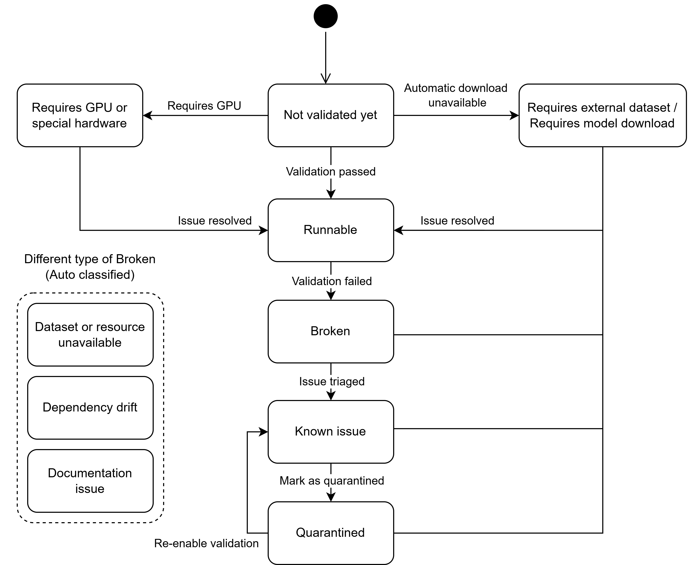

# Example Status

This is a demo `example_status.md` file for the Example Classification Matrix proposed in `proposal.md`.
The structure is intended to be migrated later into `examples/README.md` so that `examples/README.md` becomes the maintainer-facing summary of current example health.
Each example uses a shields.io badge to display its current status and can later be maintained manually or updated by CI reports generated from pull request validation, local validation, or scheduled validation runs. The status model below reflects the current standard transition flow for example restoration and maintenance.

**Last T2/T3 Validation Time:** `2026-07-07 06:55 UTC`

## Status Legend

-  `Runnable`
-  `Broken`
-  `Not validated yet`
-  `Requires external dataset or model download`
-  `Requires GPU or special hardware`
-  `Quarantined`
-  `Known issue`

### Auto-classified broken subtypes

The diagram treats some labels as machine-assigned explanations for why an example is currently `Broken`, instead of as independent top-level lifecycle states.

-  `Dataset or resource unavailable`
-  `Dependency drift`
-  `Documentation issue`

## Example Classification Matrix

| Example | Path | Status | Validation Level | Notes |
| --- | --- | --- | --- | --- |
| Demo Runnable Example | `examples/demo-runnable` |  | Full CI validation | Passed the latest scheduled smoke validation in the standard CI environment. |
| Demo Broken Example | `examples/demo-broken` |  | Not passing | Failed the latest validation run during startup and cannot complete the baseline workflow. |
| Demo Not Validated Example | `examples/demo-unvalidated` |  | Not started | Added to the inventory, but no restoration or validation work has started. |
| Demo External Dataset Example | `examples/demo-dataset` |  | Blocked by data | Validation classified the example as blocked because the required dataset is not stored in the repository and automatic preparation is unavailable. |
| Demo Model Download Example | `examples/demo-model-download` |  | Conditionally runnable | Static and dependency checks passed, but runtime validation requires downloading pretrained weights first. |
| Demo GPU Example | `examples/demo-gpu` |  | Hardware-gated | Validation classified the example as hardware-gated because CI cannot provide the required accelerator. |
| Demo Quarantined Example | `examples/demo-quarantined` |  | Excluded from CI | Temporarily removed from regular validation until the tracked follow-up issue is resolved. |
| Demo Known Issue Example | `examples/demo-known-issue` |  | Failure triaged | Latest validation reproduced the documented failure mode and the maintainer has already linked it to a tracked follow-up issue. |
| Demo Dependency Drift Example | `examples/demo-dependency-drift` |   | Needs pinning update | Scheduled validation detected a time-based failure after upstream package behavior changed; auto-classification tagged the broken reason as `Dependency drift`. |
| Demo Resource Unavailable Example | `examples/demo-resource-unavailable` |   | Externally blocked during validation | Scheduled validation could not access the required dataset, URL, or artifact; auto-classification tagged the broken reason as `Dataset or resource unavailable`. |
| Demo Documentation Issue Example | `examples/demo-doc-issue` |   | Static validation failed | Static validation found that the documented setup and checked-in files no longer match; auto-classification tagged the broken reason as `Documentation issue`. |

## Notes

- `Status` is the primary classification field, and each example should normally have one main status.
- `Broken` may include an auto-classified subtype such as `Dataset or resource unavailable`, `Dependency drift`, or `Documentation issue`.
- `Last T2/T3 Validation Time` records the most recent broad validation evidence from Tier 2 or Tier 3 validation.
- `Known issue` means the failure has already been triaged; `Quarantined` means validation was intentionally disabled until follow-up repair work is ready.
- Use the `Notes` column for additional constraints such as Python version, dataset location, hardware requirements, model download requirements, or whether the failure is pre-existing versus newly introduced.
- If CI automation is added later, the workflow can update the badges, the top-level T2/T3 validation timestamp, and the classification results in this table directly.
